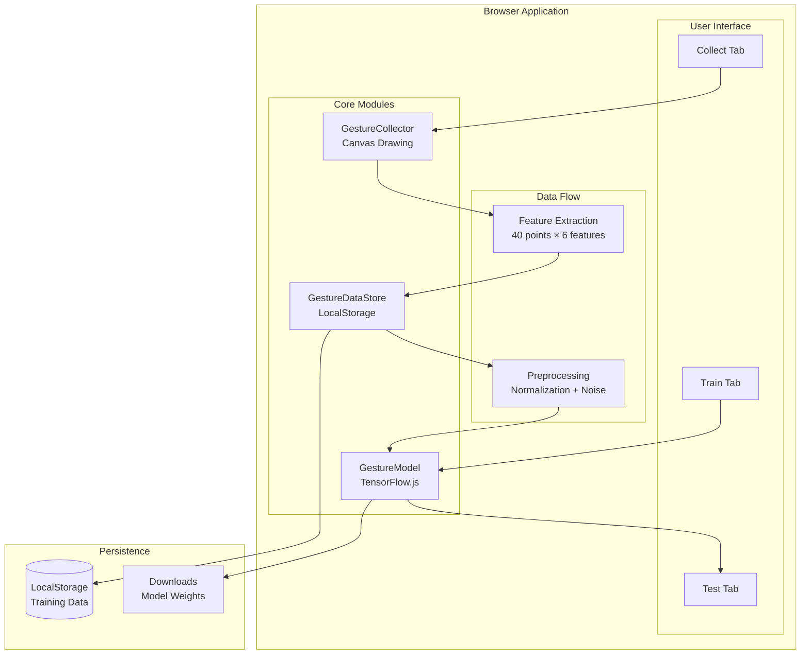
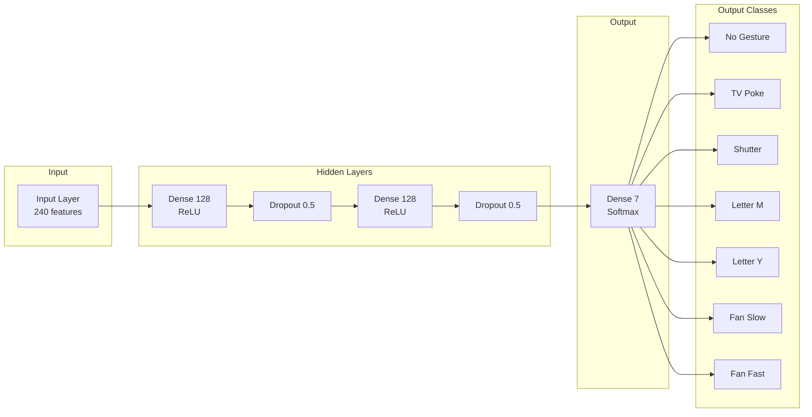
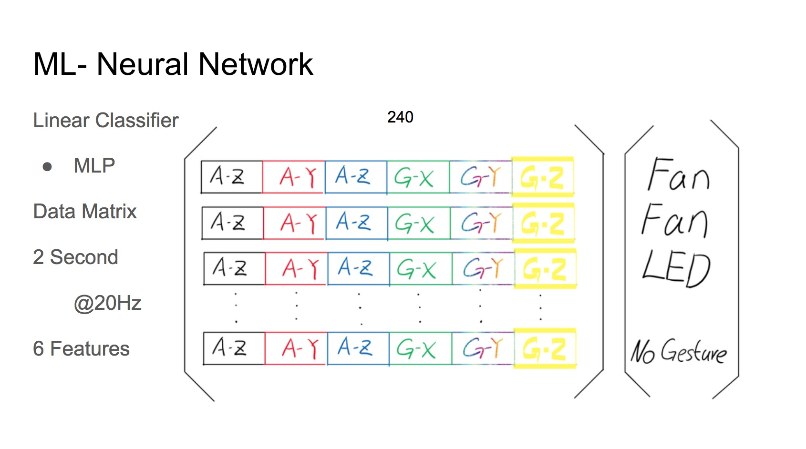
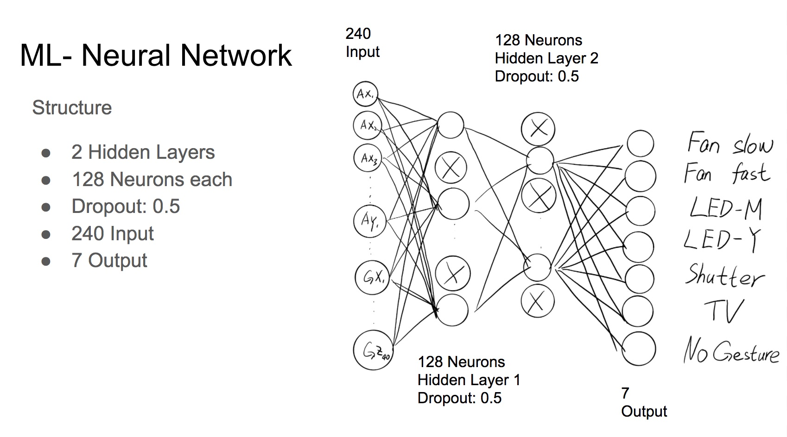

# Smart Dollhouse with Gesture Recognition

This repository contains code for gesture recognition using Machine Learning, available in two implementations:

1. **Python/Raspberry Pi** - Edge ML for smart home control with PlayStation Move controller
2. **Browser/TensorFlow.js** - Train and test gesture recognition entirely in the browser

## Features

- 7 gesture classes: No Gesture, TV Poke, Shutter Swipe, Letter M, Letter Y, Fan Slow (1 circle), Fan Fast (2 circles)
- Neural network with ~35K parameters - fast inference (~20-30ms)
- Works offline - no cloud dependency
- Train your own custom gestures

---

## Browser Version (TensorFlow.js)

A complete browser-based gesture recognition system that lets you collect training data, train a neural network, and test predictions - all running locally in your browser.

**[Try the Live Demo](https://msurguy.github.io/MYHouse-smart-dollhouse/)**

### Quick Start (Local Development)

```bash
cd web
npm install
npm run dev
```

Then open http://localhost:3000 in your browser.

### Architecture



### Neural Network Architecture



### Project Structure

```
web/
├── index.html          # Main HTML entry point
├── package.json        # Dependencies and scripts
├── vite.config.js      # Vite build configuration
└── src/
    ├── app.js          # Main application logic
    ├── model.js        # TensorFlow.js neural network
    ├── gestures.js     # Gesture collection & data store
    └── styles.css      # Application styles
```

### Features

| Tab | Description |
|-----|-------------|
| **Collect Data** | Draw gestures on canvas, select gesture type, export/import training data |
| **Train Model** | Configure epochs, learning rate, batch size; real-time loss/accuracy charts |
| **Test Model** | Draw gestures to get predictions with confidence scores |

### Scripts

| Command | Description |
|---------|-------------|
| `npm run dev` | Start development server with hot reload |
| `npm run build` | Build for production |
| `npm run preview` | Preview production build |

### How It Works

1. **Data Collection**: Draw gestures on the canvas. Each gesture is converted to 40 sample points with 6 features each (dx, dy, speed, angle, pressure, time_delta).

2. **Training**: The collected data trains a multilayer perceptron (MLP) with:
   - Input: 240 features (40 points × 6 features)
   - Two hidden layers with 128 neurons each + ReLU activation
   - Dropout (0.5) for regularization
   - Output: 7 classes with softmax activation

3. **Prediction**: Draw a gesture and get real-time predictions with confidence scores for each class.

### Model Persistence

- **Save Model**: Downloads model weights as files + saves to localStorage
- **Load Model**: Load from previously saved files or localStorage

---

## Python Version (Raspberry Pi)

The original implementation for running gesture recognition on Raspberry Pi with a PlayStation Move controller.

### Prerequisites

- Python 3
- MXNet: https://github.com/apache/incubator-mxnet
- PSMoveAPI: https://github.com/thp/psmoveapi

Note: Scripts require SUDO permissions for Bluetooth access.

### Pin Connections

| Pin | Component |
|-----|-----------|
| 6 | Fan servo |
| 4 | Left shutter servo |
| 22 | Right shutter servo |
| 18 | NeoPixel strip (29 LEDs for M/Y letters) |

### Project Structure

```
├── myhouse-gesture-recognition.py   # Main inference script
├── ssd_300-working.params           # Trained model weights
├── data-collection/
│   └── collect.py                   # Data collection from PS Move
└── training/
    ├── Myhouse-training.py          # Training script
    ├── Myhouse-training.ipynb       # Jupyter notebook
    ├── training-data-complete.csv   # Training dataset
    └── testing-data.csv             # Test dataset
```

### Data Format

The sensor data consists of 6 features per sample point:
- `gx, gy, gz` - Gyroscope readings (rotational velocity)
- `ax, ay, az` - Accelerometer readings (linear acceleration)

Each gesture captures 40 consecutive readings at 20Hz (2 seconds total).

### Machine Learning Details




---

## Gesture Classes

| ID | Gesture | Control | Description |
|----|---------|---------|-------------|
| 0 | No Gesture | Baseline | No gesture detected |
| 1 | TV Poke | TV On/Off | Single poke/tap gesture |
| 2 | Shutter | Shutters | Horizontal swipe left/right |
| 3 | Letter M | LED Group M | Draw letter M |
| 4 | Letter Y | LED Group Y | Draw letter Y |
| 5 | Fan One Circle | Fan Slow | Single circular motion |
| 6 | Fan Two Circles | Fan Fast | Two circular motions |

---

## More Information

- **License**: MIT License
- **Maintainer**: [@msurguy](https://twitter.com/msurguy) on Twitter
- **Blog Post**: https://maxoffsky.com/research-progress/project-myhouse-a-smart-dollhouse-with-gesture-recognition/
